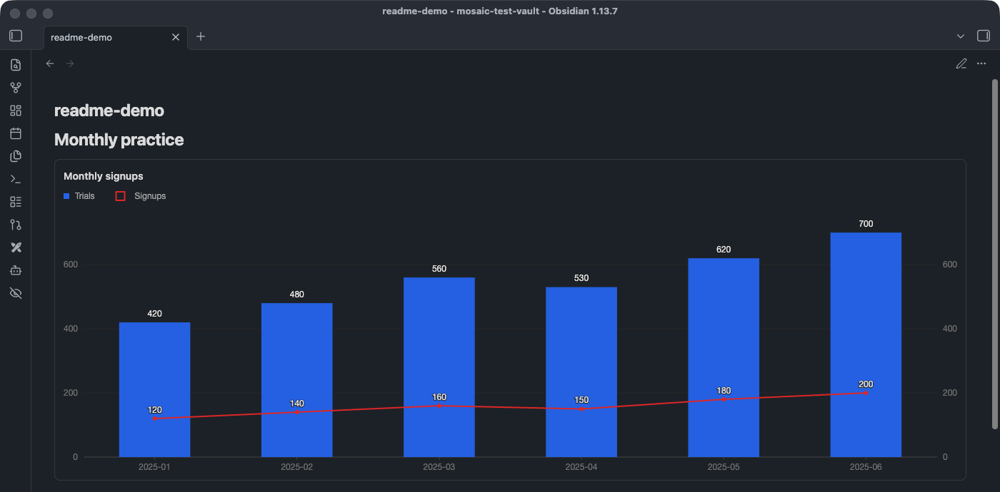
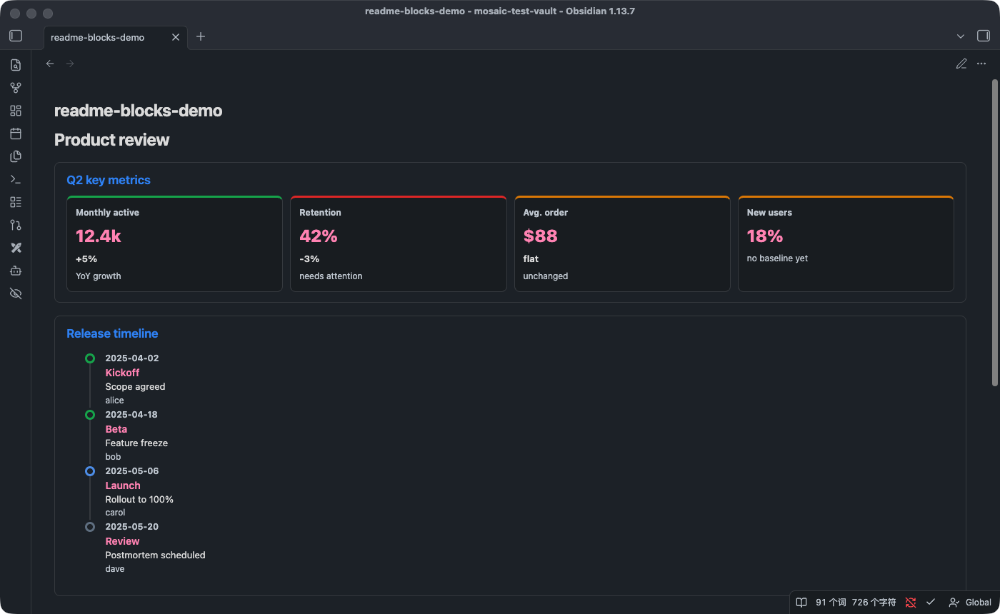

# Mosaic

Declarative content blocks for your notes: write a plain-text declaration, get rich interactive content — no changes to the source file, no external site required. Notes compose like a mosaic, one block at a time: Chart, DataTable, MetricGrid, Timeline, DecisionBox and FlowDiagram are available today; more block types are planned. Works in both `.md` and `.mdx` files.

## What it looks like





## Quick example

Paste this into a note and switch to reading view (Live Preview is not yet supported):

````text
<Chart title="Monthly signups" type="line" x="month" series="Piano,Violin" unit="users">
```csv
month,Piano,Violin
2025-01,120,140
2025-02,140,150
2025-03,160,155
```
</Chart>
````

Chart also supports a self-closing form driven by external dataset manifests (`.dataset.json`, with time-range filtering and granularity rollup) and a ```` ```chartview ```` code-block form — see the [documentation](#documentation).

## Content blocks

| Block | What it does |
| --- | --- |
| `Chart` | Line, bar, grouped/stacked bar, combo and dual-axis charts from inline CSV or external datasets |
| `DataTable` | Sortable data table from inline CSV/JSON/Markdown tables or external datasets |
| `MetricGrid` | Status-colored metric cards in an adaptive grid |
| `Timeline` | Vertical timeline with status-colored milestones |
| `DecisionBox` | Structured label/value decision record, with a free-text fallback that never errors |
| `FlowDiagram` | Auto-layout flow diagram from graph JSON or row data |

## Installation

**Community plugins** (pending marketplace review): search for "Mosaic" in Settings → Community plugins once listed.

**Manual**: download `main.js`, `manifest.json` and `styles.css` from [GitHub Releases](../../releases), copy them into `<vault>/.obsidian/plugins/mosaic/`, then enable **Mosaic** in Settings → Community plugins.

## Documentation

Detailed docs are currently in Chinese; English overview: [mosaic-intro.md](docs/mosaic-intro.md).

- [Mosaic intro](docs/mosaic-intro.md) ([中文](docs/mosaic-intro-zh.md)) — positioning, architecture and roadmap
- [Chart](docs/chart.md) — all three syntaxes, full attribute table, error examples
- [DataTable](docs/data-table.md) — inline tables or external datasets, shares the dataset query layer with Chart
- [MetricGrid](docs/metric-grid.md) — status-colored metric cards
- [Timeline](docs/timeline.md) — status-colored vertical timeline
- [DecisionBox](docs/decision-box.md) — structured label/value list, or free-text fallback
- [FlowDiagram](docs/flow-diagram.md) — auto-layout flow diagram, graph JSON or row form
- [Dataset guide](docs/dataset-guide.md) — dataset manifest contract, query semantics, troubleshooting

## Development

```bash
npm install
npm test        # node --test, pure data-layer modules
npm run build   # esbuild bundle -> main.js
```

## License

MIT. Portions of the data layer are ported from Apache-2.0 licensed code; see [NOTICE](NOTICE).
