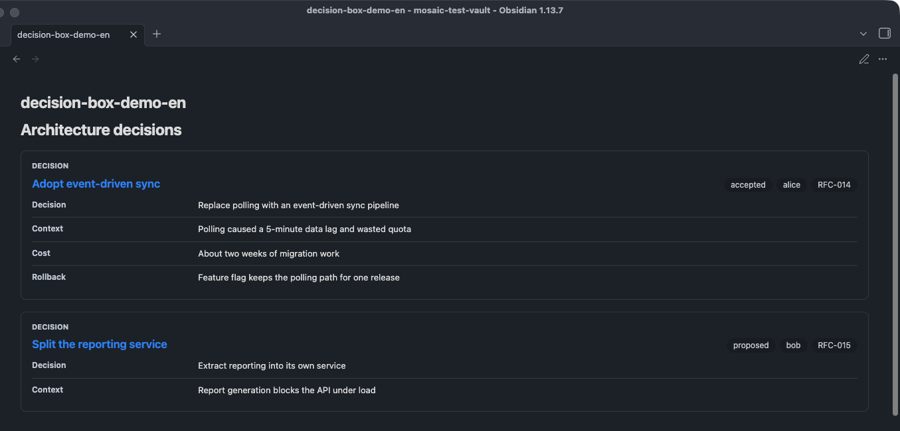

# DecisionBox

> DecisionBox 内容块的完整文档：结构化的 label/value 决策清单，或空 payload 时回退成一段极简富文本。
> 只支持成对标签入口，只支持内联 payload——不支持 `dataset` 属性、不支持 `chartview` 代码块写法。DecisionBox 是五类组件里**唯一在空/非结构化 payload 时不报错**的一个（误用 `dataset` 或畸形 JSON 仍会报错，见「报错示例」）。

## 写法

**结构化 label/value 数据**：属性写在开标签上，payload 是 label/value 行：

````text
<DecisionBox title="示例决策" status="accepted" owner="alice" source="RFC-001">
```csv
label,value
决策,采用方案 A
代价,迁移成本约两周
```
</DecisionBox>
````

**自由文本回退**（不写结构化数据，或数据里没有可用的 label/value）：

```text
<DecisionBox title="示例决策">
我们选择方案 A，理由是实现简单、迁移成本可控。
</DecisionBox>
```

- **开标签必须单行**：只有「完整的开标签独占一行」才会触发 Obsidian 的 HTML block 规则，把标签体连同围栏整体交给插件；开标签换行会被当作普通段落，标签不会被接管，按原文渲染。不支持开标签跨多行。
- **标签体内不能有空行，这一点对 DecisionBox 的富文本回退影响尤其大**：Obsidian 的 HTML block 规则一旦遇到标签体内的空行就会提前结束整个块，标签根本不会被接管，更谈不上解析出第二段。因此**自由文本回退实际只能承载单段文字或一个无序列表**，写多段落（段落之间留空行）会直接导致整个标签按原文渲染，而不是渲染出多个 `<p>`。需要多段说明时请改用结构化 label/value 数据（每行不含空行）。
- 无序列表写法（`- ` 或 `* ` 开头）在同一段落内是安全的，因为列表项之间不需要空行：

```text
<DecisionBox title="示例决策">
- 优点：实现简单
- 缺点：扩展性一般
</DecisionBox>
```

- 属性值支持双引号、单引号或不加引号三种写法。
- 闭合标签必须独占一行、与开标签同名，大小写敏感：`</DecisionBox>`。

## 属性表

| 属性 | 说明 | 归一化 |
| --- | --- | --- |
| `title` | 渲染为组件标题，无则不渲染 | 无 |
| `status`（别名 `decisionStatus`，取值优先级 `status` > `decisionStatus`） | 决策状态徽章，同时决定外层容器的 CSS 变体 | 见下表 |
| `owner` | 责任人徽章 | 直接透传 |
| `source` | 来源徽章 | 直接透传 |

DecisionBox **不支持 `dataset`**。若在标签上写 `dataset="..."`，会被当作外部数据集组件处理但因不在支持名单内而报错（见下）。

**status 状态词表**（状态词自动归一化，支持的词表见下）：

| 归一化结果 | 命中输入 |
| --- | --- |
| `accepted` / `proposed` / `rejected` / `superseded` | 显式写这四个值之一，原样透传 |
| `accepted` | `done` / `complete` / `completed` |
| `default` | 其他任意非空值 |
| `""`（不渲染徽章） | 未设置或空字符串 |

固定文案：区块头部左上角有一个不可配置的 kicker 标签，中文「决策」（英文 `Decision`），不是数据字段，永远显示。

## Payload 契约

标签体走通用的行提取规则（四条路径同 DataTable/Timeline/MetricGrid），解析出 rows 后按 label/value 别名归一化：

| 输出字段 | 别名优先级 |
| --- | --- |
| `label` | `label` ?? `key` ?? `name` ?? `item` |
| `value` | `value` ?? `text` ?? `body` ?? `description` ?? `summary` |

`label` 与 `value` 都为空的行被过滤。

**两条互斥路径**：

- **路径 A（结构化）**：过滤后至少 1 条 label/value 行时启用，渲染为 `<dl>` 定义列表；`value` 支持行内 `` `code` `` 和 `**bold**` 两种极简 markdown，其余原样转义（不支持斜体、链接、删除线、标题、引用块）。
- **路径 B（富文本回退）**：过滤后 0 条 label/value 行时启用，把整段标签体当作极简 Markdown 渲染——按空行分段（受上文 Obsidian 限制，实际只有单段生效）、`- `/`* ` 开头的行归入无序列表，其余非空行拼成一个段落。

**永不报错**：即使标签体完全为空（或自闭合无 body），也只是渲染出一个空的富文本区块，不会走错误框。这是 DecisionBox 与 DataTable/Timeline/MetricGrid/FlowDiagram 的关键差异——那四类在 rows 为空时都会报错，DecisionBox 不会。

**最小示例**（伪造数据）：

```text
<DecisionBox title="示例决策" status="accepted" owner="alice">
```csv
label,value
决策,采用方案 A
代价,迁移成本约两周
```
</DecisionBox>
```

### 报错示例

DecisionBox 本身没有「空数据」错误路径。会触发红色错误框的情形只有两类：

```text
标签上出现 dataset 属性（DecisionBox 不支持外部数据集）
→ Mosaic: External datasets support Chart and DataTable.

fenced json 围栏内是不合法 JSON
→ Mosaic: Unexpected token ... in JSON at position ...（原生 JSON 解析错误，文案随具体错误位置变化）
```

后者不是 DecisionBox 专属——通用行提取对 `json` 围栏的解析失败会直接透出原生 JSON 解析错误，其余四类组件遇到同样的畸形 JSON 也会走这条路径。

按原文渲染（不接管、不是错误框）：

- 开标签跨多行（Obsidian 段落规则不支持，见上文写法说明）。
- 标签体内出现空行（连带导致「多段落富文本回退」实际不可用，见上文写法说明）。
- 段落里混有标签以外的内容。
- 找不到独占一行的 `</DecisionBox>` 闭合标签。

## 渲染效果

> 示例截图一律使用模拟假数据（dark 主题实拍）。

结构化 label/value 两列布局 + status / owner / source 徽标（accepted 与 proposed 两种状态）：



## 相关文档

- [timeline.md](timeline.md)
- [metric-grid.md](metric-grid.md)
- [mosaic-intro.md](mosaic-intro.md)——整体定位与 Roadmap
