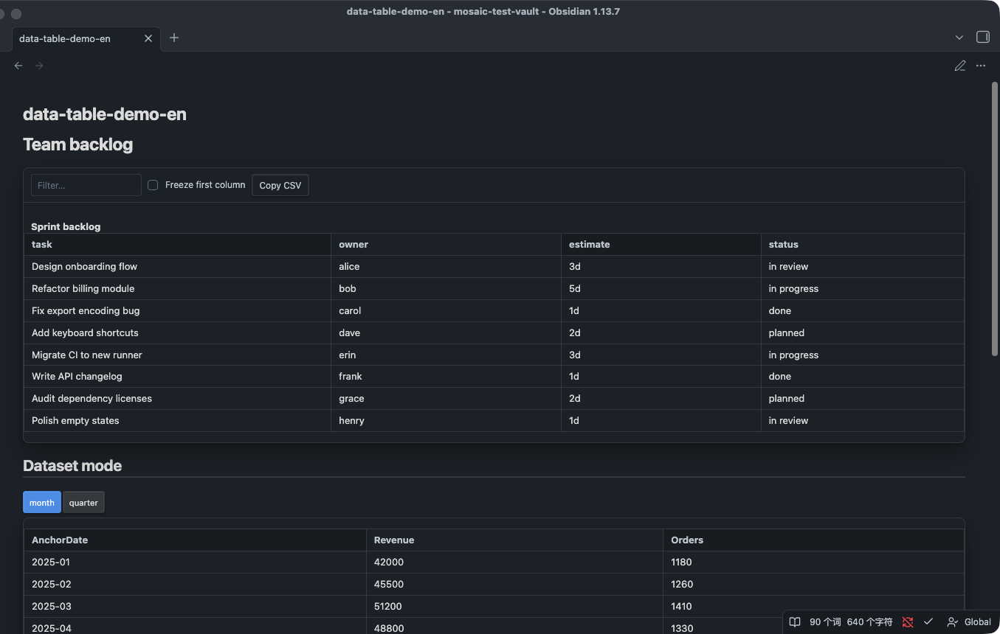

# DataTable

> DataTable 内容块的完整文档：内联表格（CSV / JSON / Markdown 表）与外部数据集（`.dataset.json`）两种数据来源，共用一套渲染。
> 只支持标签入口（成对标签为主，自闭合标签仅在 dataset 模式下才有意义）；不支持 `chartview` 代码块写法——代码块写法是 Chart 专属。

## 写法

**成对标签 · 内联数据**（主要形式）：属性写在开标签上，payload 写在标签体内。

````text
<DataTable title="示例明细" columns="item,amount,note">
```csv
item,amount,note
sample-a,10,ok
sample-b,5,watch
```
</DataTable>
````

- **开标签必须单行**：只有「完整的开标签独占一行」才会触发 Obsidian 的 HTML block 规则，把标签体连同围栏整体交给插件；开标签换行会被当作普通段落，标签不会被接管，按原文渲染。这是 Obsidian 宿主的段落切分规则决定的，不支持开标签跨多行。
- **标签体内不能有空行**：开标签到闭标签之间一旦出现空行，Obsidian 会提前结束当前 HTML block，后续内容（含围栏和闭标签）被当作独立段落解析，标签同样不会被接管。
- 属性值支持双引号、单引号或不加引号三种写法：`title="示例"`、`title='示例'`、`title=示例` 均合法，但不加引号时值不能含空白、引号或 `>`、`/`；属性的 `=` 两侧不能有空格（`title = "示例"` 不被识别，整个标签按原文渲染）。
- 闭合标签必须独占一行、与开标签同名，大小写敏感：`</DataTable>`。

**自闭合标签 · dataset 模式**（body 允许为空，因此只有引用外部数据集时才常见）：

```text
<DataTable
  dataset="demo.dataset.json"
  columns="AnchorDate,营收"
  granularity="month"
  granularityOptions="month,quarter"
/>
```

- 五类组件的标签解析都支持自闭合语法，但 DataTable 之外的四类（MetricGrid / Timeline / DecisionBox / FlowDiagram）没有 payload 就没有数据可渲染——自闭合写它们要么直接报空数据错误，要么（仅 DecisionBox）渲染出一个空壳，通常没有实际意义。

## 属性表

| 属性 | 说明 | 默认值 |
| --- | --- | --- |
| `title` | 表格标题，渲染在表格内部的 `<caption>` | 无标题则不渲染 |
| `columns` | 逗号分隔的列名列表，覆盖自动推断的列顺序 | 未设置时 = 所有行 key 的并集，按首次出现顺序 |
| `complexity` | 强制表格复杂度，只接受 `simple` / `complex` | 按行数/列数/单元格数/最长单元格自动判定，其他值忽略、回退自动判定 |
| `search` | 搜索框开关 | 复杂表格且行数 > 100 时默认开启 |
| `freezeFirstColumn`（别名 `freeze`） | 冻结首列开关 | 复杂表格且行数 > 20 且列数 ≥ 6 时默认开启 |
| `copyCsv`（别名 `copy`） | 复制 CSV 按钮开关 | 复杂表格默认开启 |
| `stickyHeader`（别名 `sticky`） | 表头吸顶开关 | 复杂表格且行数 > 20 时默认开启 |
| `dataset` | 外部 `.dataset.json` manifest 的相对路径，出现即切换到 dataset 模式 | 无 |
| `granularity` | dataset 模式下的展示粒度 | `auto` |
| `granularityOptions` | dataset 模式下允许的粒度集合，逗号分隔，每项须 ∈ `day/week/month/quarter` | `day,week,month,quarter` |
| `from` / `to` | dataset 模式下的日期范围闭区间（也可被 body 的 `query` fence 覆盖，query 优先） | 无 |

布尔属性（`search`/`freeze`/`copy`/`sticky`）接受 `true`/`false`、`1`/`0`、`yes`/`no`、`on`/`off`，大小写不敏感；其余值回退默认值。

**`columnLabels` 陷阱**：DataTable 支持一个「列显示名映射」概念，但它**只能通过 dataset 查询结果自动生成**（取 manifest 里每个字段的 `label`），**不能**当作标签属性直接写。标签属性解析永远产出字符串，`columnLabels="..."` 无论写什么都会被判定「不是对象」而静默忽略，表头依旧显示原始列名。想要自定义表头文案，请在 manifest 的 `fields[].label` 里声明（见 [dataset-guide.md](dataset-guide.md)），而不是在标签上加这个属性。

## Payload 契约

**内联模式**（无 `dataset` 属性时）：标签体走通用的行提取规则，依次尝试四条路径：

1. 标签体是一个唯一的围栏代码块（` ```json ` / ` ```tsv ` / ` ```csv ` 或缺省语言标签）：`json` 按 JSON 解析（数组本身即行数组，或 `{"rows":[...]}` 对象）；`tsv` 按 Tab 分隔；**其余任何语言标签（含拼写错误、`csv`、缺省、甚至无关标签）一律退化按逗号 CSV 解析**——语言标签只在 `json`/`tsv` 时真正生效。
2. 无围栏、裸文本以 `[` 或 `{` 开头：整体当 JSON 解析。
3. 无围栏、裸文本含 `|` 字符：当 Markdown 表格解析（第 1 行表头，第 2 行分隔行被无条件跳过不校验格式，第 3 行起是数据）。
4. 兜底：裸文本按逗号 CSV 解析。

每行是一个扁平对象，字段名 = 列头（CSV/TSV/Markdown 表）或 JSON key；DataTable **不对字段名做别名归一化**，列名就是原始 key（除非 `columns` 属性重排/裁剪）。单元格值经过数字嗅探：只有严格匹配 `^-?\d+(?:\.\d+)?$`（纯整数或小数）的单元格会转成数字，其余（含空字符串、日期、`"12%"`、`"1,234"`）保持字符串原样展示。

**dataset 模式**（有 `dataset` 属性时）：**与内联 payload 完全互斥**。行数据 100% 来自外部 manifest + 数据文件，标签体唯一合法内容是一个可选的 ` ```query ` 围栏，JSON 对象，只能含 `from`/`to`/`where` 三个键（`from`/`to` 优先于同名属性）：

````text
<DataTable dataset="demo.dataset.json" columns="AnchorDate,营收" from="2025-01-01" to="2025-06-01">
```query
{"where":[{"field":"门店","op":"eq","value":"示例门店A"}]}
```
</DataTable>
````

粒度按钮组、溯源脚注（数据集标题 · 生效窗口 · 粒度 · N/M source rows · data through）、时间对齐校验、`rollup` 语义与 dataset manifest 契约本身，与 Chart 完全一致，见 [dataset-guide.md](dataset-guide.md)。唯一的差异：Chart 会因为「图表可读密度上限 120 点」剔除过密的粒度选项，DataTable **不受此限制**，所有安全粗化后的粒度都保留在候选集合里。

### 报错示例

红色错误框（就地透出根因，前缀均为 `Mosaic: `）：

```text
内联 payload 为空或列集合为空
→ Mosaic: DataTable requires CSV, JSON, or a Markdown table.

dataset 模式 body 塞入内联 CSV（互斥冲突）
→ Mosaic: A dataset component body may contain only a fenced query JSON object.

dataset 模式 body 的 query fence 不是合法 JSON
→ Mosaic: Dataset query must contain valid JSON.

dataset 模式 body 的 query fence 是 JSON 数组而不是对象
→ Mosaic: Dataset query must be a JSON object.

dataset 属性值为空字符串
→ Mosaic: dataset must point to a .dataset.json manifest.

granularity 不在 granularityOptions 展开的集合里
→ Mosaic: granularity must be included in granularityOptions.

granularityOptions 出现 day/week/month/quarter 之外的值
→ Mosaic: granularityOptions supports day, week, month, and quarter.
```

dataset 模式下更深层的查询报错（时间对齐、粒度粗化、`where` 校验、`rollup` 缺失等）与 Chart 共用同一套查询语义，完整列表见 [dataset-guide.md](dataset-guide.md) 排错清单。

按原文渲染（不接管、不是错误框）：

- 开标签跨多行（Obsidian 段落规则不支持，见上文写法说明）。
- 标签体内出现空行。
- 段落里混有标签以外的内容。
- 找不到独占一行的 `</DataTable>` 闭合标签。

## 渲染效果

> 示例截图一律使用模拟假数据（dark 主题实拍）。三种内联 payload（CSV / JSON / Markdown 表格）渲染效果一致，不分开截图。

上：内联 CSV + 工具栏（搜索 / 冻结首列 / 复制 CSV，属性强制开启）；下：dataset 模式（month/quarter 粒度按钮组，表头显示 manifest label）：



## 相关文档

- [dataset-guide.md](dataset-guide.md)——dataset 模式共用的 manifest 契约、查询语义、排错清单
- [chart.md](chart.md)——Chart 内容块，dataset 模式的姊妹实现
- [mosaic-intro.md](../mosaic-intro.md)——整体定位与 Roadmap
