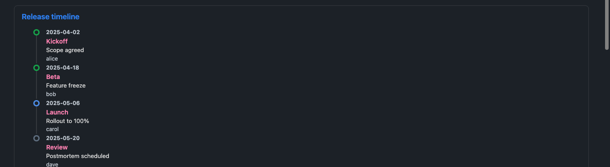

# Timeline

> Timeline 内容块的使用指导（how）：纵向时间线列表，每个节点按状态着色圆点。
> 只支持成对标签入口，只支持内联 payload——不支持 `dataset` 属性、不支持自闭合（body 为空时直接报错）、不支持 `chartview` 代码块写法。
> 标签写法通则见 [tag-syntax.md](tag-syntax.md)；纵向结构与宽容渲染的设计动机见 [design/timeline.md](../design/timeline.md)。

## 写法

属性写在开标签上，payload 写在标签体内：

````text
<Timeline title="示例进展">
```json
[
  {"date":"2026-01-01","title":"启动","body":"完成立项","status":"done"},
  {"date":"2026-01-08","title":"评审","body":"存在风险点","status":"blocked"},
  {"date":"2026-01-15","title":"开发中","body":"接口联调","status":"active"},
  {"date":"2026-01-22","title":"待排期","body":"下一步计划","status":"other"}
]
```
</Timeline>
````

写法边界（开标签必须单行、标签体内不能有空行、属性引号形态与 `=` 规则、闭合标签独占一行且大小写敏感）见 [tag-syntax.md](tag-syntax.md)。

## 属性表

| 属性 | 说明 |
| --- | --- |
| `title` | 渲染为组件标题，无则不渲染 |

Timeline **没有其他属性**——不支持 `dataset`。若在标签上写 `dataset="..."`，会被当作外部数据集组件处理但因不在支持名单内而报错（见下）。

## Payload 契约

标签体走[通用行提取四路径](tag-syntax.md#通用行提取四路径)，提取出的每行经过字段别名归一化（取第一个非空值）：

| 输出字段 | 别名优先级 |
| --- | --- |
| `date` | `date` ?? `time` ?? `month` |
| `title` | `title` ?? `name` ?? `event` |
| `body` | `body` ?? `description` ?? `summary` ?? `note` |
| `owner` | `owner` ?? `assignee` |
| `status` | 见下表 |

**没有必填字段校验**——即使一行的 `date`/`title`/`body`/`owner` 全为空，也只是渲染出一个空壳节点（各字段只在非空时才渲染对应子元素）。

**status 状态词表**（状态词自动归一化为四个桶，默认 `default`，支持的词表见下）：

| 归一化结果 | 命中输入 |
| --- | --- |
| `done` | `done` / `complete` / `completed` / `success` |
| `blocked` | `blocked` / `risk` / `warning` |
| `active` | `active` / `doing` / `progress` / `in-progress` |
| `default`（默认） | 其他任意值或未指定 |

注意：`risk`/`warning` 归入 `blocked` 桶，不是单独的状态——这与 MetricGrid 的 `risk` 桶命名相似但语义不同，容易混淆。

**空数据报错**：解析不出任何数据行时触发。

### 报错示例

红色错误框（就地透出根因，前缀均为 `Mosaic: `）：

```text
标签体为空或没有可解析的行
→ Mosaic: Timeline requires CSV, JSON, or a Markdown table.

标签上出现 dataset 属性（Timeline 不支持外部数据集）
→ Mosaic: External datasets support Chart and DataTable.
```

按原文渲染（不接管、不是错误框）的情形对全部标签组件一致，见 [tag-syntax.md](tag-syntax.md#按原文渲染的通用情形)。

## 渲染效果

> 示例截图一律使用模拟假数据（dark 主题实拍）。

纵向时间线，竖线连接、末项截断；done / active / default 状态圆点（`active` 跟随 Obsidian 主题强调色）：



## 相关文档

- [tag-syntax.md](tag-syntax.md)——标签写法通则与通用行提取规则
- [metric-grid.md](metric-grid.md)——字段别名归一化思路一致的姊妹组件
- [design/timeline.md](../design/timeline.md)——纵向结构、状态圆点与宽容渲染的设计动机
- [mosaic-intro.md](../mosaic-intro.md)——整体定位与 Roadmap
